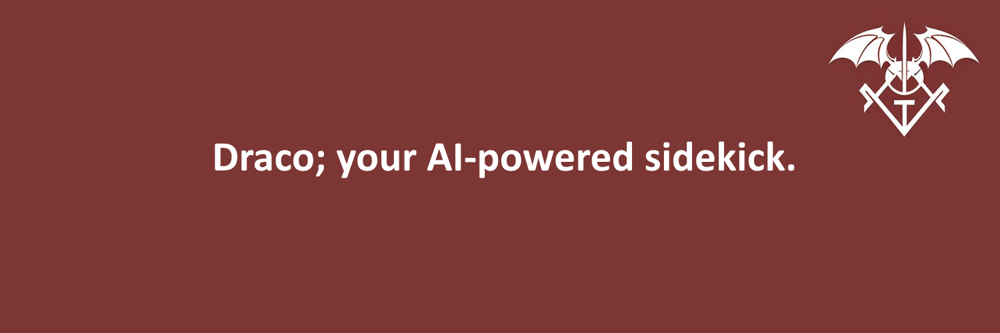

<p align="center">
  <a href="https://www.npmjs.com/package/draco-framework">NPM Package</a> | 
  <a href="https://github.com/DracoFramework/draco-framework-v1">GitHub Repository</a> | 
  <a href="https://x.com/DracoFramework">Twitter</a>
</p>

# Draco Framework

The **Draco Framework** is an open-source platform designed for creating and managing AI agent swarms. The framework offers a robust API to deploy, interact, and analyze agents across various environments, including blockchain-based systems, simulations, and real-time collaborative tasks. Draco allows developers to easily create intelligent agent swarms capable of autonomous decision-making, swarm coordination, and advanced data analysis.
## Features

- **AI Agent Swarms**: Build and manage a group of intelligent agents that can collaborate, share knowledge, and perform tasks collectively.
- **Blockchain Integration**: Deploy custom AI agents directly onto the Solana blockchain and interact with blockchain data in real-time.
- **Natural Language Interaction**: Communicate with deployed agents using natural language queries for seamless user experience.
- **Market & Trading Analysis**: Fetch real-time blockchain data such as market cap, token holders, trading activity, trending tokens, and trading patterns.
- **Custom Queries**: Execute advanced custom queries to analyze blockchain data, execute financial analysis, or fetch specific insights.
- **Cross-Platform Compatibility**: Draco works with modern Node.js environments and is fully compatible with a variety of operating systems.

## Framework Capabilities

- **Token Interaction**: Query token metrics such as market cap, price trends, and top token holders.
- **Trading Analysis**: Identify trending tokens, analyze trade volumes, and predict future trading movements based on historical data.
- **Swarm Coordination**: Agents can cooperate and share knowledge to collectively analyze data or perform complex tasks.
- **Customizable Agent Commands**: Define and execute custom scripts for agent interaction and swarm coordination.
- **Bitquery Integration**: Seamlessly integrates with Bitquery APIs to fetch blockchain data for advanced analysis and insights.
- **Real-Time Data Analysis**: Capture and analyze real-time blockchain activity to make informed decisions.
- **Distributed Systems**: Draco supports the deployment of AI agent swarms across distributed systems, making it ideal for large-scale applications.

## Installation

### Prerequisites
- Node.js (>= 16.x)
- npm (or yarn) installed

Follow these steps to install and set up Draco Framework:

1. Clone the repository:
   ```bash
   git clone https://github.com/dracoframework/draco-framework-v1.git

2. Navigate to the project directory:
   ```bash
   cd draco-framework-v1

3. Install dependencies:
   ```bash
   npm install

4. Copy .env.example to .env in the main directory, then add your environment variables.

5. Build the project:
   ```bash
   npm run build

## Advanced Features

- **Swarm Intelligence**: Draco’s swarm framework enables agents to collaborate and exchange information in real-time to solve complex problems.
- **Blockchain Data Analysis**: Easily fetch, filter, and analyze blockchain data such as token metrics, transaction history, and trade volumes.
- **Natural Language Processing**: Agents can respond to user input through natural language queries, allowing easier agent interactions.
- **Smart Contract Integration**: Draco can integrate with smart contracts on Solana and other blockchains to trigger specific actions or interact with on-chain data.
- **Customizable Behaviors**: Extend agent behavior using pre-built decision-making models, or create your own custom behaviors and logic.

## Example Applications

- **Blockchain Data Analysis**: Create swarms of agents that analyze real-time blockchain data, including token price trends, market cap, trading activity, and more.
- **Financial Modeling**: Deploy agents that perform financial forecasting based on historical blockchain data, trends, and analysis.
- **Autonomous Agents for Web3 Applications**: Use Draco to create intelligent agents that interact with decentralized applications (dApps), execute transactions, or manage smart contract interactions.
- **Collaborative Intelligence**: Build agent swarms that collaborate on complex tasks like resource allocation, task scheduling, or multi-agent simulations.

## Contributing

We welcome contributions! To get started:

1. Fork the repository.
2. Create a new branch (`git checkout -b feature-name`).
3. Commit your changes (`git commit -am 'Add new feature'`).
4. Push to your branch (`git push origin feature-name`).
5. Open a Pull Request.

## License

Draco Framework is open-source and released under the [MIT License](LICENSE).

